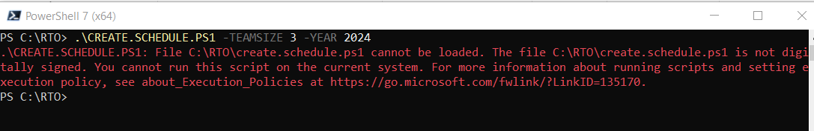
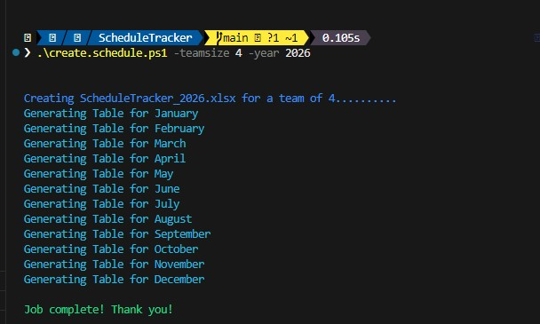
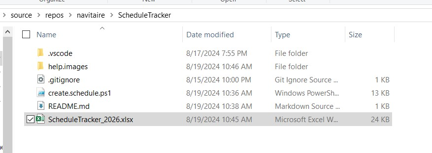
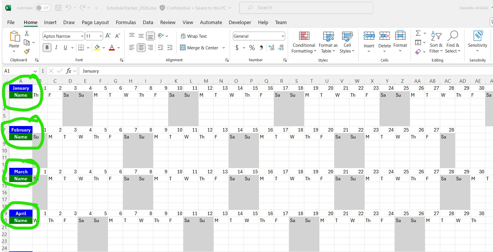
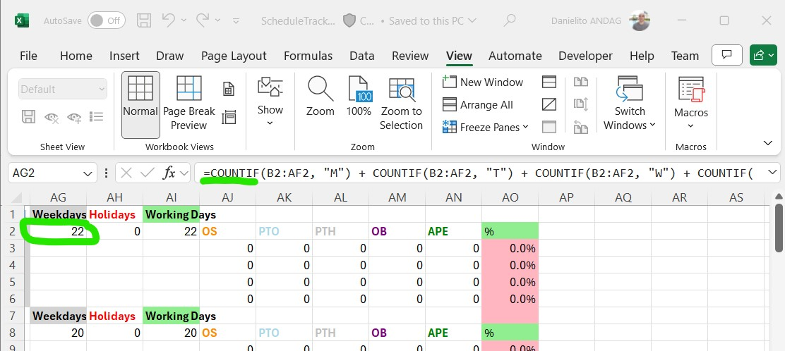
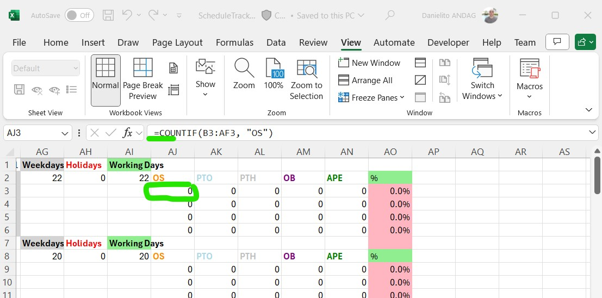
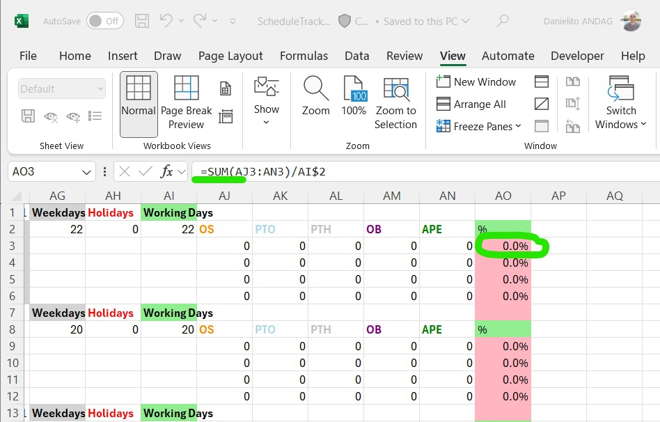
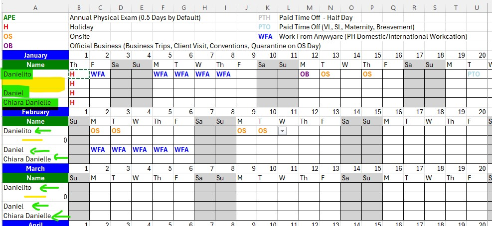
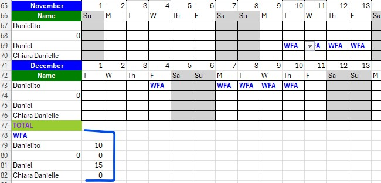

## create.schedule.ps1 tool to Create a New Schedule Tracker Sheet

1. Install latest powershell 7 by running this command in an Admin Command Prompt or Powershell Prompt to use Excel functions.  
`winget install --id Microsoft.PowerShell --source winget`
1. Clone this repo *git should installed on your machine [Installing Git](https://git-scm.com/download/win)*  
`git clone https://github.com/andagda/ScheduleTracker.git`
1. Run the script from a powershell command line 
 `.\create.schedule.ps1 -?`
 or 
 `./create.schedule.ps1 -?` to know how to use the script.  
If you get an error like this  
  
Run this command `Get-ExecutionPolicy` to check your Execution Policy.  
Then run this command `Set-ExecutionPolicy Unrestricted`

1. To get all the Details from the help file use `Get-Help .\create.schedule.ps1 -Detailed` 
1. To get the Examples from the help file details use `Get-Help .\create.schedule.ps1 -Examples`
1. Here is what should be displayed on your powershell CLI when running the script with these parameters `.\create.schedule.ps1 -teamsize 4 -year 2026`.  

1. An Excel File with **ScheduleTracker_YYYY.xlsx** will be generated in the root folder  

1. Creates a Table for Each Month of the specified year  

1. All formulas needed are pre-populated for each month  
Weekday Formula  
  
OS or Onsite Formula  

RTO % Formula  

1. You can fill in the names for the January Table and other month tables will be auto-populated with data from January.    
  
1. There is also Summary Table for WFA for each employee. These formulas are auto generated by the tool.  
  

 
