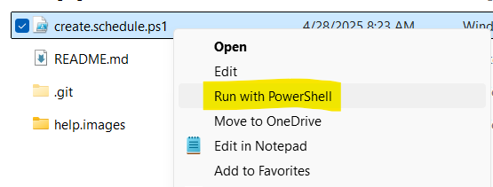
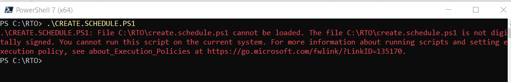
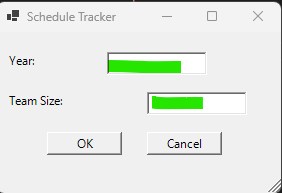
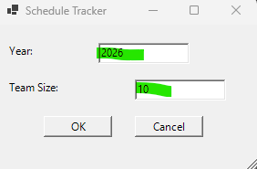
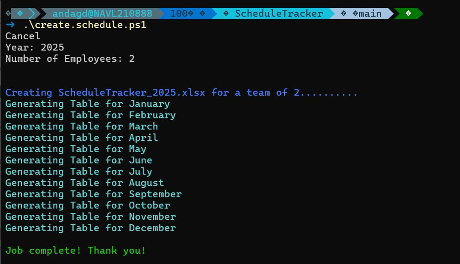
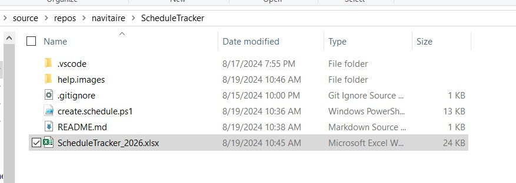
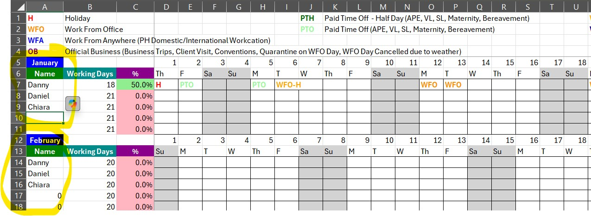
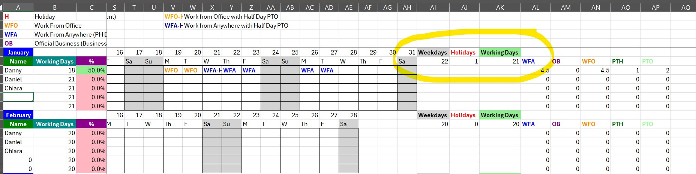
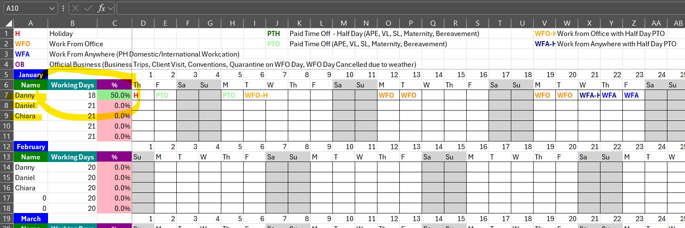
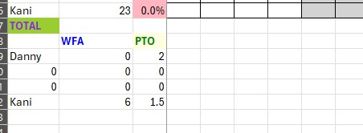

## create.schedule.ps1 tool to Create a New Schedule Tracker Sheet


1. Install latest powershell 7 by running this command in an Admin Command Prompt or Powershell Prompt to use Excel functions.  
`winget install --id Microsoft.PowerShell --source winget`
1. Clone this repo *git should installed on your machine [Installing Git](https://git-scm.com/download/win)*  
`git clone https://github.com/andagda/ScheduleTracker.git`
1. Run this script from Windows File Explorer
Open windows file explorer and right click on the create.schedule.ps1 file
 
1. Run the script from a powershell command line 
 `.\create.schedule.ps1`
 or 
 `./create.schedule.ps1`  
If you get an error like this  
  
Run this command `Get-ExecutionPolicy` to check your Execution Policy.  
Then run this command `Set-ExecutionPolicy Unrestricted`
    - To get all the Details from the help file use `Get-Help .\create.schedule.ps1 -Detailed` 
    - To get the Examples from the help file details use `Get-Help .\create.schedule.ps1 -Examples`
1. Here is what should be displayed when running the script thur file explorer or command line interface (CLI)
`.\create.schedule.ps1`.
    * User will be prompted to enter the year and team size.<br>
    <br>
    <br>

1. An Excel File with **ScheduleTracker_YYYY.xlsx** will be generated in the root folder  

1. Creates a Table for Each Month of the specified year  

1. All formulas needed are pre-populated for each month  
Weekday Formula  
  
RTO % Formula  

1. There is also Summary Table for **WFA** *(WFA-H is counted as full WFA day)* and **PTO** for each employee. These formulas are auto generated by the tool.  
  

---

## Holiday Configuration

The schedule tracker uses a `holidays.json` file to automatically populate holidays in the schedule.

### Holiday Types

The JSON file contains two types of holidays:

1. **Regular Holidays** - Fixed dates that occur every year (e.g., New Year's Day, Independence Day, Christmas)
2. **Floating Holidays** - Holidays that change dates each year (e.g., Chinese New Year, Maundy Thursday, Good Friday, National Heroes Day)

### File Location

The `holidays.json` file must be located in the same directory as the `create.schedule.ps1` script.

### File Format Example

```json
{
  "regularHolidays": [
    {
      "month": 1,
      "day": 1,
      "name": "New Year's Day"
    }
  ],
  "floatingHolidays": [
    {
      "month": 4,
      "day": 2,
      "name": "Maundy Thursday"
    }
  ]
}
```

### ⚠️ IMPORTANT: Annual Update Required

**Floating holidays MUST be updated every year** as their dates change annually. Before generating schedules for a new year:

1. Open `holidays.json` in a text editor
2. Update the `month` and `day` values for all floating holidays:
   - **Chinese New Year** - Varies based on lunar calendar (usually January or February)
   - **Maundy Thursday** - Thursday before Easter (varies by year)
   - **Good Friday** - Friday before Easter (varies by year)
   - **National Heroes Day** - Last Monday of August (varies by year)
3. Save the file before running the script

### How It Works

When the script runs, it:
- Reads the `holidays.json` file
- Checks each date in the schedule
- If a date matches a holiday AND falls on a **weekday (Monday-Friday)**, it automatically populates the cell with "H" for all employees
- Weekends are not affected by holiday configuration

### Example

If December 25, 2025 falls on a Thursday (weekday), all employees will automatically have "H" populated for that day in their schedule. If it falls on a Sunday, no "H" will be populated since it's already a weekend.

 


 
